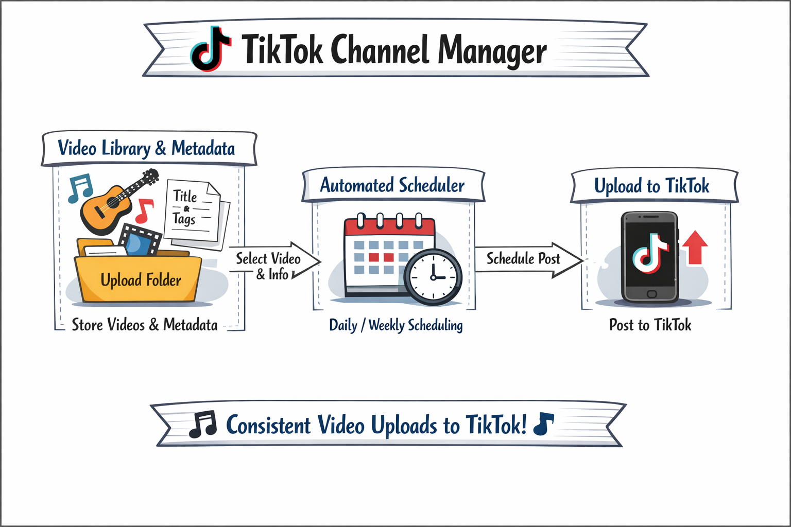

# Personal TikTok Channel Manager
This is a private internal tool developed for personal use to manage and upload video content to my own TikTok account.

The app is used only by the developer for authentication and automated video uploads.

No third-party users are supported, and no user data is collected, stored, or shared.

## How It Works

  

[Terms of Use](Terms-of-Use) | [Privacy Policy](Privacy-Policy)